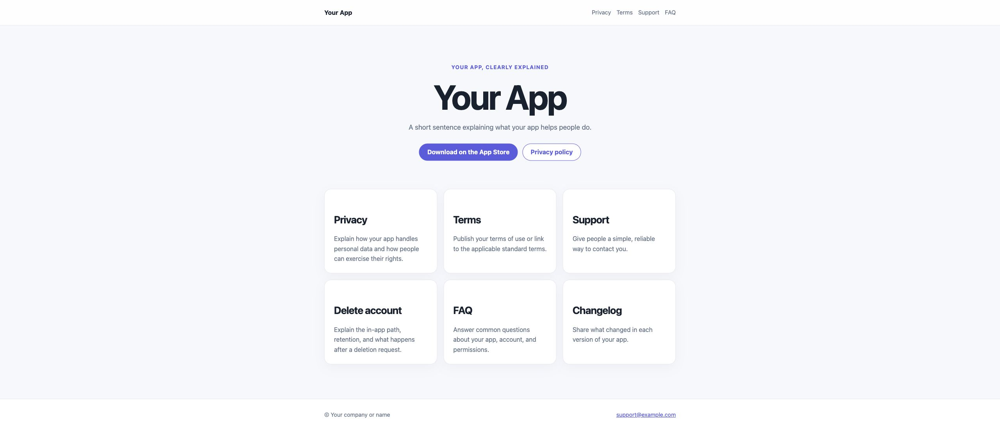
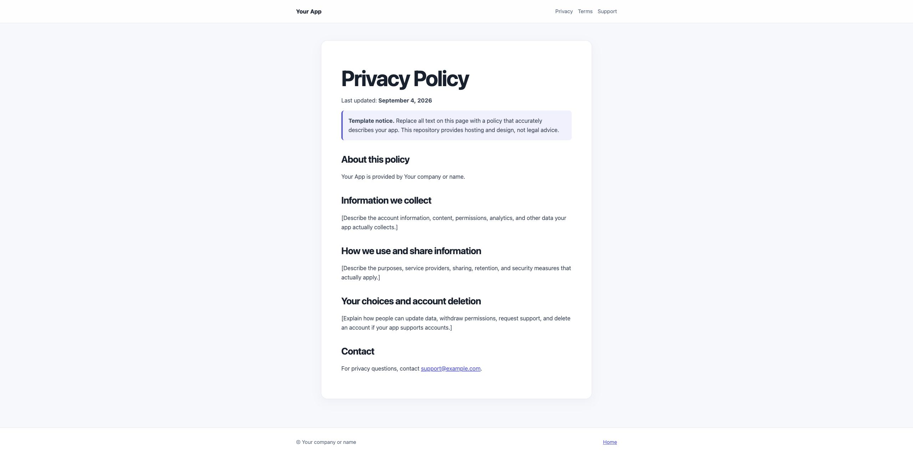

# App Legal Pages Template

**Publish a professional privacy policy URL, account-deletion page, support page, FAQ, changelog, and optional mobile app landing page — free, public, and without setting up a website.**

Built for indie iOS, Android, and web-app makers who need a public legal or support URL for the App Store, Google Play, or their own app. It works directly with **GitHub Pages**: no hosting account, no deployment command, and no web-development experience required.

## What you get

- A simple home page to present your app (optional).
- A public `privacy.html` page for your privacy policy.
- A `terms.html` page for your terms of use.
- A support contact page, FAQ, release changelog, and account-deletion instructions.
- A mobile-friendly design that works on GitHub Pages and other static hosts.
- One small configuration file for your app name, email address, App Store link, colour, and last-updated date.

## Publish your pages — no-code guide

Allow about 10 minutes for your first setup.

1. On this repository page, click **Use this template** (the green button near the top), then choose a name for your copy.
2. In your new repository, open `assets/config.js`. Click the pencil icon, replace the example app name, email address, App Store link, colour, and date, then click **Commit changes**.
3. Open each page you need — especially `privacy.html`, `terms.html`, and `delete-account.html` — and replace every sentence in square brackets (`[LIKE THIS]`) with information that is true for your app.
4. Open **Settings**, then **Pages**. Under **Build and deployment**, select **Deploy from a branch**, choose `main` and `/(root)`, then save.
5. Wait one or two minutes. GitHub will show your public address, normally: `https://YOUR-USERNAME.github.io/YOUR-REPOSITORY/`
6. Your privacy-policy link will be: `https://YOUR-USERNAME.github.io/YOUR-REPOSITORY/privacy.html`

You can edit a page at any time in GitHub: open the file, click the pencil icon, save with **Commit changes**, then wait briefly for the public site to refresh.

## Which pages do I need?

Start with the pages your app actually needs. The home page is optional.

| If you need… | Use this page |
| --- | --- |
| A public privacy-policy URL for an app store | `privacy.html` |
| A way for users to ask for help | `support.html` |
| Account deletion instructions | `delete-account.html` |
| Terms of use | `terms.html` |
| Answers to common questions | `faq.html` |
| Release notes | `changelog.html` |
| A lightweight product site | `index.html` |

If you only need a privacy policy, publish the template as-is and share the `privacy.html` link. You do not need to fill in the landing page.

## Before sharing an App Store or Google Play link

- Open the final URL in a private/incognito browser window.
- Check that it starts with `https://` and does not require a login.
- Make sure the text describes your real data collection, sharing, permissions, retention, and account-deletion behaviour.
- Put the exact `privacy.html` URL in your store listing and inside your app where appropriate.

## Make it yours

All common details are in `assets/config.js`. The legal and help text stays directly in the relevant page so it is easy to find and edit.

You can also use a custom domain later, for example `legal.yourapp.com`, from **Settings → Pages → Custom domain**.

## Important: this is not legal advice

This project gives you a clean public home for your own content. It does **not** write, review, or guarantee a legally compliant privacy policy, terms, or deletion process. Only publish statements that accurately reflect how your app works; seek qualified legal advice when you need it.

## License

MIT. Replace `[YOUR NAME]` in `LICENSE` before publishing if desired.
